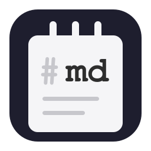
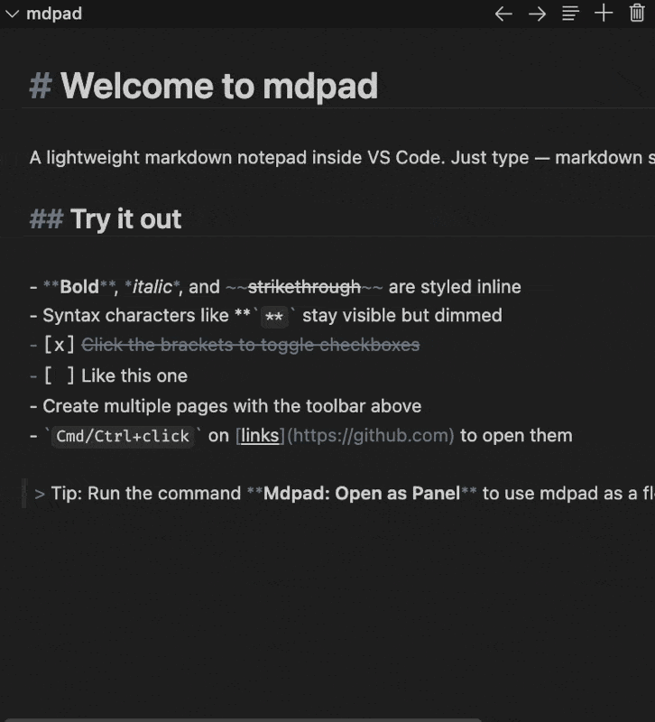

# mdpad

[](https://marketplace.visualstudio.com/items?itemName=tbekaert.mdpad)
[](https://open-vsx.org/extension/tbekaert/mdpad)

A lightweight markdown notepad inside VS Code. Type markdown and see it styled live — syntax stays visible but dimmed, content is formatted as you write.



## Quick Start

1. Install mdpad from the [VS Code Marketplace](https://marketplace.visualstudio.com/items?itemName=tbekaert.mdpad) or [Open VSX](https://open-vsx.org/extension/tbekaert/mdpad)
2. Open the **Explorer sidebar** — mdpad appears as a panel
3. Start typing markdown

That's it. Your notes persist across restarts, per workspace.

## Features

### Muted-syntax editing

Markdown characters (`#`, `**`, `*`, `` ` ``, `~~`) stay visible but dimmed. Content is styled live — headings are large, bold is bold, code is monospace.

### Multiple pages

Create, switch, and delete note pages from the toolbar dropdown. Page titles are derived automatically from the first heading or first line of content.

### Keyboard shortcuts

| Action        | Mac            | Windows/Linux  |
| ------------- | -------------- | -------------- |
| Bold          | `Ctrl+B`       | `Ctrl+B`       |
| Italic        | `Ctrl+I`       | `Ctrl+I`       |
| Strikethrough | `Ctrl+Shift+X` | `Ctrl+Shift+X` |

### Interactive elements

- **Checkboxes** — click `[ ]` or `[x]` to toggle task list items
- **Links** — `Cmd+click` (Mac) or `Ctrl+click` (Windows/Linux) to open URLs
- **Tables** — columns align automatically as you type

### Floating panel

Run the command **Mdpad: Open as Panel** to detach mdpad from the sidebar and use it as a standalone editor panel. Dock it anywhere in your VS Code layout.

### GFM support

Headings, bold, italic, strikethrough, links, blockquotes, task lists, fenced code blocks, tables, and horizontal rules.

### Theme-aware

Adapts to any VS Code color theme — dark, light, or high contrast.

## Contributing

Contributions welcome! Clone the repo and press `F5` to launch the extension in a development host.

```bash
git clone https://github.com/tbekaert/vscode-mdpad.git
cd vscode-mdpad
pnpm install
```

## License

GPL-3.0-or-later
